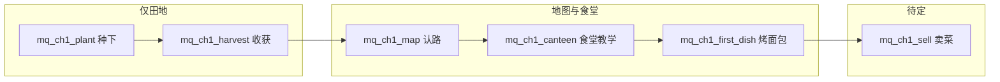

# 主线任务设计（M6）

> **角色**：新档**除田地外默认上锁**；线性主线用「条件达标 → 发放 unlock」教会 **种菜 → 做菜 → 卖菜赚钱**（卖菜段玩法仍在优化，本章仅占位）。  
> **真源**：本文 §2～§7 任务表与锁定矩阵；表数据在 `data/main_quests.json`；对白在 `data/stories.json`。  
> **不写**：批次 ✅（→ `development-plan.md` §6.6）、独立任务板 UI、具体售价/经验数值。  
> **文档分工**：`docs/doc-governance.md`

## 1. 原则

| 原则 | 说明 |
|------|------|
| **一条当前目标** | `GameCore.getCurrentMainQuest()` = 表中第一条未记入 `completedMainQuestIds` 的项。 |
| **功能锁** | 地图 / 食堂 / 小铺 / 背包 / 果园 / 订单等，新档 `save.unlocks.*` 均为未解锁；**田地 `farm` 不写入 unlock，默认可用**。 |
| **教学优先** | 章一主线只服务「会种、会收、会认路、会下厨」；等级成长、里程碑、好感、订单交付**不是**章一必修。 |
| **自动发奖** | `checkMainQuests()` 达标后写入 unlock（可无奖步骤，见 §3）；UI 用 `drainMainQuestGrants()` 弹提示。 |
| **不是任务板** | 无多页日常列表；任务条（P0-1 起）只展示当前一步的 title/desc。 |

### 1.1 与旧引导的关系

- `stories.json` 里 `type: tutorial` 仍是**气泡教学**（何时弹、讲什么）。  
- `main_quests.json` 是**进度与解锁**（何时算「这一步做完」、打开什么系统）。  
- 主线引用的 `storyRead` 条件 = 对应 tutorial 已记入 `readTutorials`。  
- 主线专用的认路/指路节点可用 `afterTutorialIds` +「仅当前主线 storyRead 目标可弹」规则（见 `GameCore.pendingTutorial`），避免抢在首条种田教学之前弹出。

---

## 2. 新档锁定矩阵（产品真源）

| 玩家能力 / 入口 | unlock 键 | 新档 | 章一由哪步放开（见 §5～§6） |
|-----------------|-----------|------|------------------------------|
| 田地种植收获 | （无键，默认可用） | ✅ | — |
| 丰穗镇地图 | `map` | 🔒 | §5 **mq_ch1_map** |
| 食堂（烹饪） | `canteen` | 🔒 | §6 **mq_ch1_canteen** |
| 林婶小铺（直卖） | `shop` | 🔒 | §7 卖菜线 **待定** |
| 背包页 | `bag` | 🔒 | §5 **mq_ch1_bag**（收菜后链式发放） |
| 果园 | `orchard` | 🔒 | M6-P1，不在章一 |
| 订单 / 交单 | `orders` | 🔒 | M6-P2，不在章一 |

**UI 纪律（实现期）**：底栏 / 地图热点 / 田地右下角入口均须 `hasUnlock(key)`；未解锁时不切页，可 toast「跟着当前主线走」。体验版旧档迁移：缺 `unlocks` 时按 §8 补全开锁，避免老玩家被锁死。

---

## 3. `main_quests.json` 字段

| 字段 | 说明 |
|------|------|
| id | 全局唯一，建议 `mq_ch{章}_{短名}` |
| title / desc | 任务条文案（desc 可写玩家动作提示） |
| complete | §4 |
| grant | 可选；有则 `{ "unlock": "<UnlockKey>" }`，无则省略（只推进进度不发功能） |
| npcId | 可选，策划备注 / 任务条头像 |

---

## 4. 完成条件 `complete.type`

| type | 判定 | 章一用途 |
|------|------|----------|
| `storyRead` | `storyId` ∈ `readTutorials` 或 `readAffinityStories` | 认路、食堂口播 |
| `harvestCount` | `stats.harvestCount` ≥ count | 第一次收获 |
| `plantCount` | `stats.plantCount` ≥ count | 第一次播种（**待实现**：`plant()` 累加） |
| `recipeDiscovered` | `discoveredRecipes` 含 `recipeId`（不含黑暗料理作章一目标） | 做出指定菜 |
| `farmLevel` | `GameCore.level` ≥ level | 章一暂不用 |

触发 `checkMainQuests()`：构造器末尾、`completeTutorial` / `completeAffinityStory`、`plant`、`harvest`、`collectDish`（新发现食谱时）、升级跨级后。

---

## 5. 章一 · 种菜任务（已定稿）

目标：玩家在**仅田地**可用的情况下，完成「买种 → 种下 → 等待 → 收获」闭环；**不**要求已解锁地图/食堂。

| 顺序 | id | title | desc（玩家向） | complete | grant | 配套教学 |
|------|-----|-------|----------------|----------|-------|----------|
| 1 | `mq_ch1_plant` | 撒上第一把种子 | 点空地，选小麦种下去 | `plantCount` ≥ 1 | — | 进入田地 `onEnter` → `tut_farm_plant`（田伯） |
| 2 | `mq_ch1_harvest` | 收回第一袋粮 | 等麦子熟了，点地块收获 | `harvestCount` ≥ 1 | — | 首次收获 `onHarvest` → `tut_farm_harvest` |
| 3 | `mq_ch1_bag` | 认认行囊 | 点左上角背包，看看收下来的作物 | `harvestCount` ≥ 1 | `bag` | 与第 2 步同次收获链式完成；顶栏「背包」overlay |

**设计备注**

- 第 1 步以**行为**（`plantCount`）为准，避免只听完气泡不算完成。  
- 第 2～3 步在同一次 `harvest` 后由 `checkMainQuests` 链式完成：先记收获、再发放 `bag`；背包内已有小麦，为章「做菜」备料；**不在此步解锁小铺**（卖菜线待定）。  
- 认路前的 grant 仅 `bag`，地图仍等 `mq_ch1_map`。

**实现过渡**：在 `plantCount` 未落代码前，可临时将 `mq_ch1_plant` 的 complete 设为 `storyRead: tut_farm_plant`（表内注释标「过渡」）；落地 `plantCount` 后改回上表。

---

## 6. 章一 · 做菜任务（已定稿）

目标：在已能**进地图、进食堂**的前提下，完成「带料 → 组合 → 下锅 → 出锅发现食谱」；首道目标菜与 sim 教学一致：**烤面包 `toast`**（小麦 ×2）。

| 顺序 | id | title | desc（玩家向） | complete | grant | 配套教学 |
|------|-----|-------|----------------|----------|-------|----------|
| 4 | `mq_ch1_map` | 认一认丰穗镇 | 听田伯说完镇子怎么走 | `storyRead: tut_mq_map_tianbo` | `map` | 已种收后田地 `onEnter`；`afterTutorialIds`: 种植+收获教学 |
| 5 | `mq_ch1_canteen` | 去食堂看看 | 从地图进入食堂，听白婆婆讲灶台 | `storyRead: tut_canteen` | `canteen` | 食堂 `onEnter` → `tut_canteen` |
| 6 | `mq_ch1_first_dish` | 出锅第一道菜 | 用小麦做出烤面包 | `recipeDiscovered: toast` | — | 已有 `tut_canteen`；出锅揭晓图鉴 |

**依赖顺序**

1. 必须先 **mq_ch1_map** 拿到 `map`，地图热点才可进食堂场景（热点仍须 `hasUnlock('canteen')` 才允许进入——见下）。  
2. **mq_ch1_canteen** 的 grant 发放 `canteen`，玩家才能从地图点进食堂并完成 `tut_canteen`。  
3. **实现可选优化**：将 `map` + `canteen` 合并为一步双 grant（需扩展 `grant` 为数组）；表结构未扩展前保持上表两步。

**黑暗料理**：不作为章一完成条件；`tut_dark` 仍在首次黑暗出锅时触发，与主线进度无关。

---

## 7. 章一 · 卖菜赚钱（待定）

玩法与入口仍在调整（直卖 vs 订单、小铺 UI）。章一**只预留**下列方向，**不写入** `main_quests.json` 直至卖菜方案定稿：

| 占位 id | 意图 | 可能 complete | 可能 grant |
|---------|------|---------------|------------|
| `mq_ch1_sell` | 教会「把货换成金币」 | `totalGoldEarned` ≥ N 或 `sellCount` ≥ 1（类型待增） | `shop` |
| （可选） | 与林婶订单衔接 | 交付指定求购 | `orders`（M6-P2） |

定稿后：在本文补 §7 真表，并同步 `data-schema.md` 与 sim 断言。

---

## 8. 存档与旧档

- `unlocks`: `Partial<Record<UnlockKey, boolean>>`  
- `completedMainQuestIds`: `string[]`  
- `stats.plantCount` / `stats.harvestCount`：章一行为计数（`plantCount` 待实现）  

**旧档 / 体验版**：若 `completedMainQuestIds` 为空且玩家已有多项进度，迁移策略由实现单开（建议：已发现 `toast` 则补全章一种菜+做菜主线并写入对应 unlock，避免锁死食堂）。

---

## 9. 章一流程（总览）

---

## 10. 修订记录

| 日期 | 变更 |
|------|------|
| 2026-10-09 | P0-0：首条 `mq_ch1_map` + unlock 基础设施 |
| 2026-10-09 | 章一定稿：全锁矩阵；种菜 §5、做菜 §6；卖菜 §7 待定；扩展 complete / unlock 口径 |
